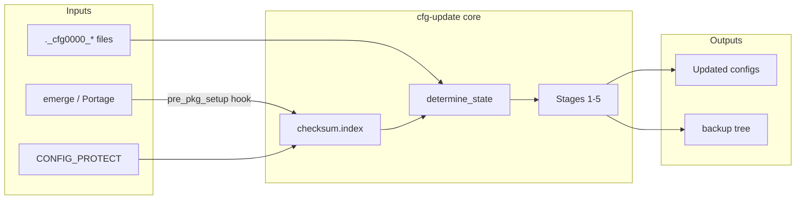

# cfg-update Architecture

This document describes how `cfg-update` works internally. For a file-by-file inventory and cleanup plan, see [INVENTORY.md](INVENTORY.md).

## Overview

`cfg-update` is a single Perl script (~2,500 lines, 53 subroutines) that:

1. Maintains a **checksum index** of files in `CONFIG_PROTECT` directories
2. Scans for Portage config update markers (`._cfg????_*`)
3. Classifies each pending file by modification state
4. Routes it through up to five update stages
5. Optionally manages backups for future 3-way merges



## Startup sequence

Every invocation follows the same bootstrap (see `cfg-update` lines 69–420):

1. **Load config** — Parse `/etc/cfg-update.conf` into globals (`MERGE_TOOL`, `ENABLE_STAGE*`, paths).
2. **Parse CLI** — `Getopt::Long` with bundling; flags parsed in a loop (up to 25 passes).
3. **Select package manager** — Default Portage (`/var/log/emerge.log`). `--paludis` switches to Paludis (`/var/log/paludis.log`).
4. **Ensure index exists** — If `/var/lib/cfg-update/checksum.index` is missing and not `--ebuild`, build it (requires root).
5. **Run mode dispatch** — Jump to the subroutine for `-l`, `-u`, `-i`, etc.
6. **Pre-flight (normal runs)** — Unless `--ebuild`:
   - `check_hooks` — Install/enable Portage and Paludis index hooks
   - `check_tool` — Verify merge tool exists; disable stages 3/4 if unsupported

## Checksum index

The index solves a timing problem: after a new package installs, Portage's `CONTENTS` files already reflect the *new* checksums, so you cannot tell if the live config was user-modified.

**Format** (`/var/lib/cfg-update/checksum.index`):

```
Portage:1704067200
/etc/ssh/sshd_config abcd1234...
/etc/conf.d/net efgh5678...
```

- **Line 1:** `{package_manager}:{timestamp}` — timestamp of last merge from `emerge.log`
- **Remaining lines:** `{path} {md5}` for every file under `CONFIG_PROTECT`

**Rebuild trigger** (`check_index`):

- Compare index timestamp vs last `::: completed emerge` line in `emerge.log`
- Rebuild if they differ, or if `-f` / `--force`
- Skip rebuild if pending `._cfg*` updates exist in protected dirs (must clear updates first)

**Build process** (`build_index`):

```
echo /var/db/pkg/*/*/CONTENTS | xargs grep "^obj /etc" | cut -d" " -f2-3 >> index
```

Uses `xargs` instead of `grep` on a pipe to avoid argument-length limits on large systems.

## Portage hook integration

`check_hooks` runs on every normal invocation and manages `/etc/portage/bashrc`:

```bash
pre_pkg_setup() {
    [[ $ROOT = / ]] && cfg-update --index
}
```

- If the hook block exists but is commented out, it is re-enabled
- If missing, it is appended
- Disable on uninstall: `cfg-update --disable-portage-hook`

This replaced the older approach of aliasing `emerge` in `/root/.bashrc`. The legacy emerge wrapper scripts and PHP helper were removed in stage 3.

## Paludis hook integration (optional, best-effort)

If `/usr/bin/cave` exists, `check_hooks` also installs a Paludis hook:

| Item | Value |
|------|-------|
| Source | `/usr/lib/cfg-update/cfg-update_indexing` |
| Target | `/usr/share/paludis/hooks/install_all_pre/cfg-update.bash` |
| Action | `cfg-update --index --paludis` |

The hook path matches [Paludis hook layout](https://paludis.exherbo.org/configuration/hooks.html) (`install_all_pre` under `/usr/share/paludis/hooks/`). The hook script does not use ebuild-phase helpers (`PALUDIS_EBUILD_DIR`) because `install_all_pre` is a general hook with a limited environment.

Disable: `cfg-update --disable-paludis-hook`

### Paludis-specific code paths

When `--paludis` is passed (or the Paludis hook runs):

| Setting | Value |
|---------|-------|
| `$pkg_manager` | `Paludis` |
| `$install_log` | `/var/log/paludis.log` |
| `$find_string` | `finished install of package` |
| CONFIG_PROTECT | `$pkg_db/.cache/all_CONFIG_PROTECT` |
| CONFIG_PROTECT_MASK | `$pkg_db/.cache/all_CONFIG_PROTECT_MASK` |

Index building still reads Portage-format `CONTENTS` files under `$pkg_db` — the same tree Paludis uses on Gentoo.

> **Status (1.9.1):** Best-effort and **not verified** on a live Paludis system in this fork. Portage is the supported path. Override `PALUDIS_HOOK` in `/etc/cfg-update.conf` if your hook directory differs.

## Finding and classifying updates

### Discovery (`find_updates`)

Recursively scans `CONFIG_PROTECT` directories for files matching `._cfg????_*` (configurable via `CONFIG_NEW` in config).

### State classification (`determine_state`)

Compares the live file, the `._cfg*` update, and the checksum index. Code uses `STATE_*` constants (e.g. `STATE_MF`) with human-readable labels from `%STATE_DESC`:

| Code | Meaning | Typical stages |
|------|---------|------------------|
| MF | Modified file | 2, 3, 4 |
| MB | Modified binary | 5 |
| UF | Unmodified file | 1, 2, 3, 4 |
| UB | Unmodified binary | 1, 5 |
| CF | Custom file (not in index) | 4 |
| CB | Custom binary | 5 |
| LF | Link → file | 5 |
| FL | File → link | 5 |
| LL | Link → link | 5 |

## Update pipeline

`update_files` orchestrates the session:

```
schedule_automatic_updates  →  stage 1 queue, stage 2 queue
schedule_manual_updates     →  stage 3 queue, stage 4 queue, stage 5 queue
```

Each stage subroutine accepts `pretend` or `execute` (from `-p`).

### Stage 1 — Automatic overwrite (`update_stage1`)

If `md5(live_file) == md5(in_index)`, the file was never customized → replace with `._cfg*` content.

### Stage 2 — Automatic diff3 (`update_stage2`)

If a backup pair exists from a prior cfg-update run (`._old-cfg_*` / `._new-cfg_*` in backup tree):

```
diff3 -m new_update ancestor live_file > merged
```

No conflict markers → apply merged result. Conflict → defer to stage 3.

### Stage 3 — Manual 3-way merge (`update_stage3`)

Launches the configured merge tool with ancestor, live, and new files. Requires a tool with 3-way support (meld, kdiff3, xxdiff, tkdiff, imediff).

### Stage 4 — Manual 2-way merge (`update_stage4`)

Merges live file and `._cfg*` update when no backup exists. Works with all supported tools.

### Stage 5 — Manual special cases (`update_stage5`)

Interactive prompts for binaries, symlinks, and custom files.

### Merge tool dispatch (`launch_tool`)

Builds tool-specific command lines. Tool capabilities are detected in `check_tool`:

- **2-way:** kdiff3, xxdiff, sdiff, imediff2, meld, vimdiff, …
- **3-way:** xxdiff, kdiff3, meld, tkdiff, imediff
- **GUI check:** `check_gui` verifies `$DISPLAY` before launching GUI tools

## Backup system

Backups live under `/var/lib/cfg-update/backups/`, mirroring the original path:

```
/var/lib/cfg-update/backups/etc/ssh/._old-cfg_sshd_config   # previous live file
/var/lib/cfg-update/backups/etc/ssh/._new-cfg_sshd_config   # previous ._cfg file
```

These enable stage 2's 3-way merges on subsequent updates.

| Command | Purpose |
|---------|---------|
| `-b` / `--backups` | List available backups |
| `-r N` / `--restore N` | Restore backup #N |
| `--optimize-backups` | Remove redundant backups while keeping merge-capable pairs |
| `--move-backups` | Migrate backup directory (used during package upgrades) |

## Key global paths

| Variable | Default | Set in |
|----------|---------|--------|
| `$settings` | `/etc/cfg-update.conf` | hardcoded |
| `$index_file` | `/var/lib/cfg-update/checksum.index` | config |
| `$backup_path` | `/var/lib/cfg-update/backups` | config |
| `$portage_hook` | `/etc/portage/bashrc` | config |
| `$paludis_hook` | `/usr/share/paludis/hooks/install_all_pre/cfg-update.bash` | config |
| `$pkg_db` | `/var/db/pkg` | config |
| `$install_log` | `/var/log/emerge.log` | hardcoded (Portage) |
| `$config_new` | `._cfg????_*` | config |

## Repository layout vs installed layout

| Repo file | Installed path |
|-----------|----------------|
| `cfg-update` | `/usr/bin/cfg-update` |
| `cfg-update.conf` | `/etc/cfg-update.conf` |
| `cfg-update.8` | `/usr/share/man/man8/cfg-update.8` |
| `cfg-update_indexing` | `/usr/lib/cfg-update/cfg-update_indexing` |

## Testing

Integration tests live under [`test/`](../test/). Per-scenario fixtures are in [`test/fixtures/`](../test/fixtures/); the harness is [`test/run-tests.sh`](../test/run-tests.sh) (see [`test/README.md`](../test/README.md)). Run `./test/run-tests.sh` from the repo root (no root required); use `--full` for ebuild/CI parity. The ebuild `src_test()` invokes the same harness when `USE=test`.