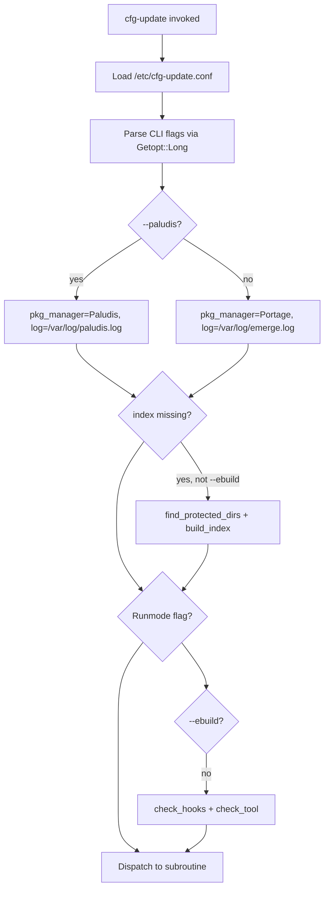

# cfg-update Inventory

**Branch:** `refactor/stage-1-inventory`  
**Generated:** 2026-06-16  
**Repo:** [rich0/cfg-update](https://github.com/rich0/cfg-update)  
**Upstream version:** 1.8.2-r1 (Gentoo, May 2007); fork maintained since 2011  
**Target usage:** Single-host Gentoo with Portage (`emerge`); Paludis kept if trivial

---

## Executive summary

`cfg-update` is a **single-host Perl monolith** that automates Gentoo config-file updates after package merges. It is an alternative to Portage's `etc-update`, with a 5-stage pipeline (automatic overwrite, automatic diff3, manual 3-way, manual 2-way, manual binary/link handling), checksum indexing, and backup/restore.

The repository has **no package-manager manifest** (no `package.json`, `cpanfile`, ebuild). Dependencies are system binaries and Perl core/extension modules. Several files reflect **deprecated installation paths** (emerge alias in `/root/.bashrc`, PHP/bash emerge wrappers) superseded by the `/etc/portage/bashrc` hook installed automatically at runtime.

---

## Repository file map

| File | Lines | Role | Keep? |
|------|------:|------|-------|
| [`cfg-update`](../cfg-update) | 2490 | Main Perl program (54 subroutines) | **Yes** — core |
| [`cfg-update.conf`](../cfg-update.conf) | 167 | Config template (installed as `/etc/cfg-update.conf`) | **Yes** |
| [`cfg-update.8`](../cfg-update.8) | 192 | Man page | **Yes** (update stale refs in stage 2) |
| [`cfg-update_indexing`](../cfg-update_indexing) | 12 | Paludis hook script (copied to `/usr/share/paludis/hooks/...`) | **Yes** if Paludis kept |
| ~~emerge wrappers / phphelper~~ | — | Legacy emerge alias wrappers | **Removed** (stage 3) |
| [`ChangeLog`](../ChangeLog) | 235 | Gentoo ebuild changelog (historical) | **Yes** (historical) |
| [`COPYING`](../COPYING) | — | GPL v2 | **Yes** |
| [`test.tgz`](../test.tgz) | — | Fixture tree for manual testing | **Yes** — valuable for future CI/tests |

**Install-time paths referenced in code (not in this repo tarball):**

| Path | Purpose |
|------|---------|
| `/usr/bin/cfg-update` | Installed binary (copy of repo `cfg-update`) |
| `/usr/lib/cfg-update/cfg-update_indexing` | Source for Paludis hook copy |
| `/etc/portage/bashrc` | Portage `pre_pkg_setup` hook target |
| `/var/lib/cfg-update/checksum.index` | MD5 checksum index |
| `/var/lib/cfg-update/backups/` | Per-file update backups |
| `/var/log/emerge.log` | Portage last-merge timestamp |
| `/var/db/pkg/*/*/CONTENTS` | Portage file metadata for indexing |

---

## Architecture: startup flow



Every normal invocation (unless `--ebuild`) runs `check_hooks` and `check_tool` before the selected runmode, which **auto-installs Portage/Paludis hooks** and validates the merge tool.

---

## CLI flags and runmodes

| Flag | Subroutine | Root required | Single-host priority |
|------|------------|:-------------:|:--------------------:|
| `-l`, `--list` | `list_updates` | No | **High** |
| `-u`, `--update` | `update_files` | Yes | **High** |
| `-i`, `--index` | `check_index` | Yes | **High** |
| `-b`, `--backups` | `list_backups` | No | Medium |
| `-r`, `--restore` | `restore_backups` | Yes | Medium |
| `-a`, `--automatic-only` | (modifier for `-u`) | Yes | Medium (cron) |
| `-m`, `--manual-only` | (modifier for `-u`) | Yes | Low |
| `-p`, `--pretend` | (modifier) | Varies | Medium |
| `-f`, `--force` | (modifier for index) | Yes | Medium |
| `-v`, `--verbose` | STDERR visible | No | Medium |
| `-d`, `--debug` | `show_debug_info` | No | Low |
| `-t`, `--tool` | Override merge tool | Varies | Medium |
| `--paludis` | Sets Paludis mode for `--index` | Yes | Low |
| `--optimize-backups` | `optimize_backups` | Yes | Medium |
| `--disable-portage-hook` | `disable_portage_hook` | Yes | Medium (uninstall) |
| `--disable-paludis-hook` | `disable_paludis_hook` | Yes | Low |
| `--ebuild` | Suppresses hooks/tool check | — | Internal (ebuild install) |
| `--testsandbox` | Bypass `root_only` with `--ebuild` | — | Internal (test harness) |
| `--help` | `print_usage` | No | **High** |

---

## Subroutine inventory

### Core update pipeline (keep)

| Subroutine | Lines | Purpose |
|------------|------:|---------|
| `find_protected_dirs` | 853 | Read `CONFIG_PROTECT` / `CONFIG_PROTECT_MASK` |
| `find_masked_dirs` | 886 | Apply protect masks |
| `find_updates` | 919 | Scan for `._cfg????_*` files |
| `determine_state` | 982 | Classify file state (MF, UF, CF, …) |
| `list_updates` | 1045 | `-l` output |
| `update_files` | 1100 | Main update orchestrator |
| `schedule_automatic_updates` | 1140 | Queue stages 1–2 |
| `schedule_manual_updates` | 1156 | Queue stages 3–5 |
| `update_stage1`–`update_stage5` | 1201–1637 | Per-stage logic |
| `update_retry`, `update_canceled`, `update_merge_*`, `update_replace_complete`, `update_keep_complete` | 1637–1771 | Interactive update handlers |
| `make_temp_backups` | 1176 | Temp files during merge |

### Index and hooks (keep)

| Subroutine | Lines | Purpose |
|------------|------:|---------|
| `check_index` | 545 | Compare index timestamp vs emerge.log |
| `build_index` | 585 | Rebuild MD5 index from CONTENTS |
| `check_hooks` | 490 | Auto-enable Portage bashrc + Paludis hooks |
| `disable_portage_hook` | 2087 | Uninstall Portage hook |
| `disable_paludis_hook` | 2109 | Uninstall Paludis hook |

### Backup/restore (keep)

| Subroutine | Lines | Purpose |
|------------|------:|---------|
| `find_backups`, `list_backups`, `restore_backups` | 1788–1964 | Backup management |
| `optimize_backups` | 1964–2087 | Backup seeding for future auto-merge |
| `prepare_filenames_for_updating`, `prepare_filenames_for_restoring` | 934, 1803 | Path normalization |

### Merge tools (keep)

| Subroutine | Lines | Purpose |
|------------|------:|---------|
| `check_tool` | 628 | Detect tool capabilities; disable stages 3/4 if unsupported |
| `check_gui` | 608 | X11 availability check |
| `launch_tool` | 692 | Build per-tool command lines |
| `tool_intro` | 2148 | User guidance per tool |

### Utilities (keep)

| Subroutine | Purpose |
|------------|---------|
| `strip` | Config line parsing |
| `readkey` | Interactive input |
| `md5sum` | Checksum helper |
| `root_only` | UID check |
| `show_warning`, `print_usage`, `show_debug_info`, `done` | UX |

### Dead or stub code (removal candidates)

| Subroutine / artifact | Evidence | Recommendation |
|-----------------------|----------|----------------|
| ~~`breakpoint`~~ | Zero call sites | **Removed** (stage 3) |
| ~~`test_code` / `--test`~~ | Empty stub; superseded by `test/run-tests.sh` | **Removed** (issue #27) |
| ~~`list_dirs` / `-s`~~ | Debug wrapper over `portageq config_protect` | **Removed** (issue #28) |
| ~~`diff_two_files`, `diff_three_files`~~ | Undocumented ad-hoc merge shortcut | **Removed** (issue #28) |
| ~~`move_backups` / `--move-backups`~~ | Pre-1.8.0 inline backup migration | **Removed** (issue #28) |
| ~~`$log_file`, `@merge_history`~~ | Only referenced in commented merge logging | **Removed** (issue #28) |
| ~~emerge wrappers / phphelper~~ | Superseded by Portage bashrc hook | **Removed** (stage 3) |
| Stale hook/merge messages in `cfg-update` | xxdiff defaults, "alias" wording | **Fixed** (stage 3) |

---

## Hook integration paths

### Portage (primary — keep)

**Mechanism:** `check_hooks` (L490–543) writes to `/etc/portage/bashrc`:

```perl
pre_pkg_setup() {
    [[ $ROOT = / ]] && cfg-update --index
}
```

**Trigger:** Runs before every emerge on live systems (`$ROOT = /`).  
**Disable:** `--disable-portage-hook` comments out the hook line.  
**Status:** Active, correct for modern Portage. No repo file needed beyond the main script.

### Paludis (optional, best-effort — stage 5 complete)

**Detection:** `/usr/bin/cave` exists (L493).  
**Hook install:** Copies `/usr/lib/cfg-update/cfg-update_indexing` → `$paludis_hook`  
**Default hook path:** `/usr/share/paludis/hooks/install_all_pre/cfg-update.bash` — matches Paludis docs  
**Hook script:** [`cfg-update_indexing`](../cfg-update_indexing) — hardened (no `PALUDIS_EBUILD_DIR`)  
**Stage 5 fixes:** `find_masked_dirs` Paludis branch pushed to `@maskdir` (was `@dir`); not verified on live Paludis host

### Deprecated emerge wrappers (remove in stage 3)

These were installed as `/usr/bin/emerge` replacements via `.bashrc` alias (pre-2007). The Portage bashrc hook made them obsolete. **Removed in stage 3.**

---

## 5-stage update model

| Stage | Config flag | Automatic? | Description |
|-------|-------------|:----------:|-------------|
| 1 | `ENABLE_STAGE1` | Yes | Overwrite unmodified files (MD5 matches index) |
| 2 | `ENABLE_STAGE2` | Yes | diff3 merge when backup exists |
| 3 | `ENABLE_STAGE3` | No (GUI/CLI) | Manual 3-way merge on stage-2 conflicts |
| 4 | `ENABLE_STAGE4` | No | Manual 2-way merge (no backup) |
| 5 | `ENABLE_STAGE5` | No | Binaries, links, custom files |

**File state codes:** MF, MB, UF, UB, CF, CB, LF, FL, LL (documented in [`cfg-update.conf`](../cfg-update.conf) L115–126).

**Modifiers:**
- `-a` / `--automatic-only` — stages 1–2 only (cron-friendly)
- `-m` / `--manual-only` — skip stages 1–2

---

## Merge tool support

**Config default:** `MERGE_TOOL = /usr/bin/meld` ([`cfg-update.conf`](../cfg-update.conf) L18)  
**Code default (before config load):** `/usr/bin/xxdiff` ([`cfg-update`](../cfg-update) L43) — overridden by config on install

| Tool | 2-way | 3-way | GUI | Code refs | Gentoo status (2026) |
|------|:-----:|:-----:|:---:|-----------|---------------------|
| meld | yes | yes | yes | launch_tool, check_tool | **In portage** — recommended default |
| kdiff3 | yes | yes | yes | launch_tool | Optional |
| xxdiff | yes | yes | yes | launch_tool, stale error text L635 | **Removed** from portage ~2011 |
| tkdiff | yes | yes | yes | launch_tool | Rare |
| imediff / imediff2 | yes | yes/no | no | launch_tool (2025 patch) | Optional CLI |
| sdiff | yes | no | no | fallback in check_tool | **Core** — always available |
| vimdiff / gvimdiff | yes | no | mixed | launch_tool | Optional |
| gtkdiff | yes | no | yes | launch_tool | Optional; stage 3 disabled |
| kompare | yes | no | yes | launch_tool | KDE; rare |
| beediff | — | — | — | **Comments only** in cfg-update.conf | Never implemented in launch_tool |
| diff3 | auto | — | no | launch_tool (stage 2 internal) | **Core** |

**Stale messaging:** `check_tool` (L635–637) still recommends `dev-util/xxdiff`; should reference `meld` in stage 2 docs pass.

---

## External dependencies

### Perl modules

| Module | Type | Used for |
|--------|------|----------|
| `strict` | pragma | — |
| `File::Basename` | core | `$progname`, `dirname` |
| `Getopt::Long` | core | CLI parsing |
| `Term::ANSIColor` | CPAN (usually `dev-perl/TermReadKey` stack) | Colored output |
| `Term::ReadKey` | CPAN | Interactive keypress |

**Renovate note:** No `cpanfile` exists. Add one in stage 6 if CPAN tracking is desired.

### System binaries (runtime)

| Binary | Required? | Used in |
|--------|:---------:|---------|
| `perl` | **Yes** | Interpreter |
| `emerge` | **Yes** (Portage) | Hook detection |
| `diff3` | **Yes** (stage 2) | Automatic merge |
| `md5sum` | **Yes** | Checksums |
| `grep`, `cut`, `xargs`, `echo`, `head`, `tac`, `sed` | **Yes** | Index build |
| `id` | **Yes** | Root check |
| `stty` | Optional | sdiff width |
| Merge tool (meld, etc.) | **Yes** for manual stages | `launch_tool` |
| `cave` | Optional | Paludis detection |
| `php` | Optional | Only for deprecated phphelper |

### Gentoo packages (documented for DEPENDENCIES.md)

| Package | Purpose |
|---------|---------|
| `app-portage/cfg-update` (ebuild, external) | Install wrapper — not in this repo |
| `sys-apps/findutils` | `xargs` for index (per ChangeLog) |
| `dev-util/meld` (recommended) | Default merge tool |
| `dev-perl/Term-ANSIColor`, `dev-perl/TermReadKey` | Perl deps |

---

## Stale / inconsistent references

| Location | Issue | Stage to fix |
|----------|-------|--------------|
| [`cfg-update`](../cfg-update) L35 | `$website = "http://people.zeelandnet.nl/xentric"` — dead link | stage 2 (docs) |
| [`cfg-update.8`](../cfg-update.8) L180 | Same dead URL | stage 2 |
| [`cfg-update`](../cfg-update) L43–44 | Code defaults to xxdiff; config defaults to meld | stage 2 (document) or stage 3 (align code default) |
| [`cfg-update`](../cfg-update) L635–637 | Error text recommends xxdiff | stage 3 |
| Wrappers + phphelper | "disable alias in /root/.bashrc" | stage 3 (remove files) or update if kept |
| ChangeLog vs code | Paludis hook path naming | stage 5 |
| [`cfg-update.8`](../cfg-update.8) L173 | Index path `/usr/lib/cfg-update/checksum.index` | stage 2 — actual default is `/var/lib/cfg-update/checksum.index` |

---

## Test fixtures

Legacy archive [`test.tgz`](../test.tgz) (still shipped in the ebuild) contained a flat `test/` directory. Stage 6 extracts scenarios into [`test/fixtures/`](../test/fixtures/) — one subdirectory per case. See [`test/README.md`](../test/README.md).

| Scenario directory | State | Stage |
|--------------------|-------|-------|
| `stage1-unmodified-text` | UF | 1 |
| `stage1-unmodified-binary` | UB | 1 |
| `stage2-3way-merge-success` | MF | 2 |
| `stage2-3way-merge-conflict` | MF | 2 → 3 |
| `stage4-manual-2way` | MF | 4 |
| `stage4-custom-file` | CF | 4 |
| `stage5-modified-binary` | MB | 5 (`._cfg0000_test_modified_binary` added for harness) |
| `stage5-custom-binary` | CB | 5 |
| `stage5-file-to-link` | LF | 5 |
| `stage5-link-to-file` | FL | 5 |
| `stage5-link-to-link` | LL | 5 |

Each scenario has `etc/` (live + `._cfg*` files), optional `backups/etc/test/` (ancestors), `checksum.index.entry`, and `scenario.md`. Combined index: `test/fixtures/checksum.index.seed`. Legacy setup script: `test/fixtures/legacy/prepare_cfg-update_test`.

**Stage 6b (done):** [`test/run-tests.sh`](../test/run-tests.sh) Tier 0/A, [`test/lint-fixtures.sh`](../test/lint-fixtures.sh). **Stage 6c:** sandbox `root_only` bypass for `-u` and `--index` with `--testsandbox` + `--ebuild`; ebuild `src_test()` via `FEATURES=test`. **Tier E:** Portage `--index` via [`test/fixtures/index-portage/`](../test/fixtures/index-portage/) (Paludis not covered). CI/Renovate deferred.

---

## Feature retention matrix (single-host Portage)

| Feature | Retain | Rationale |
|---------|:------:|-----------|
| 5-stage update pipeline | **Yes** | Core value |
| Checksum index + `--index` | **Yes** | Required for stage 1 |
| Portage bashrc hook | **Yes** | Primary automation path |
| Backup/restore/optimize | **Yes** | Required for 3-way merge |
| `-l`, `-u`, `-a`, `-p` | **Yes** | Daily usage |
| Paludis hook + `--paludis` | **Yes** (minimal) | Low cost if path valid |
| ~~sshfs multi-host (`-h`, `--mount`)~~ | — | Removed (1.10.0); HOWTO at git tag 1.9.0 |
| ~~emerge wrapper scripts~~ | — | Removed (stage 3) |
| ~~PHP helper~~ | — | Removed (stage 3) |
| ~~`--test` stub / `test_code`~~ | — | Removed (issue #27); use `test/run-tests.sh` |
| ~~`-s`, ad-hoc diff modes, `--move-backups`~~ | — | Removed (issue #28, 1.10.1) |
| ~~`breakpoint` subroutine~~ | — | Removed (stage 3) |

---

## Recommended stage 2–6 actions (derived from this inventory)

| Stage | Branch | Actions |
|-------|--------|---------|
| 2 | `refactor/stage-2-docs` | README, ARCHITECTURE.md, DEPENDENCIES.md; fix man page stale paths |
| 3 | `refactor/stage-3-dead-code` | ~~Remove wrappers, phphelper, `breakpoint`; fix xxdiff error text~~ **Done** |
| 4 | `refactor/stage-4-deprecations` | ~~Runtime warnings; slim hosts file~~ **Done** (1.9.1) |
| 7 | `refactor/prune-sshfs` | ~~Remove sshfs multi-host support~~ **Done** (1.10.0) |
| 5 | `refactor/stage-5-paludis` | ~~Paludis maskdir fix, hook hardening, best-effort docs~~ **Done** (1.9.1) |
| 6 | `refactor/stage-6-tests` / `refactor/stage-6c-sandbox-tests` | Fixtures, harness, sandbox tests, ebuild `src_test`; CI/Renovate deferred |

---

## Renovate applicability

| Manager | Applicable now? | Notes |
|---------|:---------------:|-------|
| `github-actions` | After stage 6 | Pin action versions in CI workflow |
| `cpan` | After adding `cpanfile` | Optional |
| `npm`, `cargo`, etc. | No | Not used |
| Gentoo packages | No | Manual tracking in DEPENDENCIES.md |

---

## Git metadata

| Field | Value |
|-------|-------|
| Remote | `git@github.com:rich0/cfg-update.git` |
| Default branch | `master` |
| Latest commit | `9ded746` (2025-07-27) — imediff 3-way merge fix |
| Prior activity gap | 2014 → 2025 |