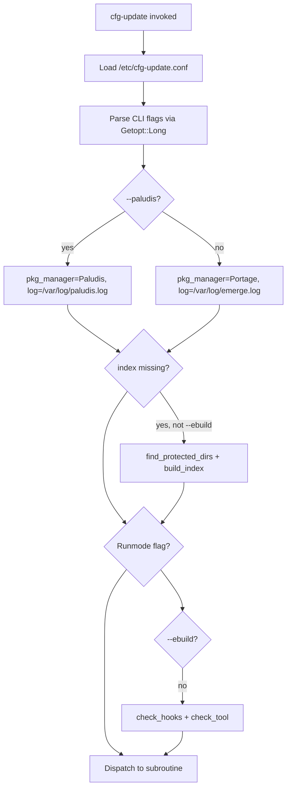

# cfg-update Inventory

**Updated:** 2026-06-20 (issue #29)  
**Repo:** [rich0/cfg-update](https://github.com/rich0/cfg-update)  
**Version:** 1.10.3  
**Target usage:** Single-host Gentoo with Portage (`emerge`); Paludis best-effort

---

## Executive summary

`cfg-update` is a **single-host Perl monolith** that automates Gentoo config-file updates after package merges. It is an alternative to Portage's `etc-update`, with a 5-stage pipeline (automatic overwrite, automatic diff3, manual 3-way, manual 2-way, manual binary/link handling), checksum indexing, and backup/restore.

The repository has **no language-level lockfile** (no `package.json`, `cpanfile`). Dependencies are system binaries and Perl core/extension modules. A reference ebuild lives in [`gentoo/`](../gentoo/); Gentoo users install via `emerge app-portage/cfg-update`. Integration is via the `/etc/portage/bashrc` hook installed automatically at runtime.

---

## Repository file map

| File | Lines | Role |
|------|------:|------|
| [`cfg-update`](../cfg-update) | 2074 | Main Perl program (47 subroutines) |
| [`cfg-update.conf`](../cfg-update.conf) | 166 | Config template (installed as `/etc/cfg-update.conf`) |
| [`cfg-update.8`](../cfg-update.8) | 149 | Man page |
| [`cfg-update_indexing`](../cfg-update_indexing) | 12 | Paludis hook script (copied to `/usr/share/paludis/hooks/...`) |
| [`gentoo/cfg-update-1.10.3.ebuild`](../gentoo/cfg-update-1.10.3.ebuild) | — | Reference Gentoo ebuild with `src_test()` |
| [`ChangeLog`](../ChangeLog) | — | Gentoo ebuild changelog (historical) |
| [`COPYING`](../COPYING) | — | GPL v2 |
| [`test/run-tests.sh`](../test/run-tests.sh) | — | Integration test harness (Tiers 0–F) |
| [`test/fixtures/`](../test/fixtures/) | — | Per-scenario synthetic Portage fixtures |

**Install-time paths referenced in code (not in this repo tarball):**

| Path | Purpose |
|------|---------|
| `/usr/bin/cfg-update` | Installed binary (copy of repo `cfg-update`) |
| `/usr/lib/cfg-update/cfg-update_indexing` | Source for Paludis hook copy |
| `/etc/portage/bashrc` | Portage `pre_pkg_setup` hook target |
| `/var/lib/cfg-update/checksum.index` | MD5 checksum index |
| `/var/lib/cfg-update/backups/` | Per-file update backups |
| `/var/log/emerge.log` | Portage last-merge timestamp |
| `/var/db/pkg/*/*/CONTENTS` | Portage file metadata for indexing |

---

## Architecture: startup flow



Every normal invocation (unless `--ebuild`) runs `check_hooks` and `check_tool` before the selected runmode, which **auto-installs Portage/Paludis hooks** and validates the merge tool.

---

## CLI flags and runmodes

| Flag | Subroutine | Root required | Priority |
|------|------------|:-------------:|:--------:|
| `-l`, `--list` | `list_updates` | No | **High** |
| `-u`, `--update` | `update_files` | Yes | **High** |
| `-i`, `--index` | `check_index` | Yes | **High** |
| `-b`, `--backups` | `list_backups` | No | Medium |
| `-r`, `--restore` | `restore_backups` | Yes | Medium |
| `-a`, `--automatic-only` | (modifier for `-u`) | Yes | Medium (cron) |
| `-m`, `--manual-only` | (modifier for `-u`) | Yes | Low |
| `-p`, `--pretend` | (modifier) | Varies | Medium |
| `-f`, `--force` | (modifier for index) | Yes | Medium |
| `-v`, `--verbose` | STDERR visible | No | Medium |
| `-d`, `--debug` | `show_debug_info` | No | Low |
| `-t`, `--tool` | Override merge tool | Varies | Medium |
| `--paludis` | Sets Paludis mode for `--index` | Yes | Low |
| `--optimize-backups` | `optimize_backups` | Yes | Medium |
| `--disable-portage-hook` | `disable_portage_hook` | Yes | Medium (uninstall) |
| `--disable-paludis-hook` | `disable_paludis_hook` | Yes | Low |
| `--ebuild` | Suppresses hooks/tool check | — | Internal (ebuild install) |
| `--testsandbox` | Bypass `root_only` with `--ebuild` | — | Internal (test harness) |
| `--help` | `print_usage` | No | **High** |

---

## Subroutine inventory

### Core update pipeline

| Subroutine | Purpose |
|------------|---------|
| `find_protected_dirs`, `find_masked_dirs` | Read `CONFIG_PROTECT` / masks |
| `find_updates`, `determine_state` | Scan and classify `._cfg????_*` files |
| `list_updates`, `update_files` | `-l` output and main orchestrator |
| `schedule_automatic_updates`, `schedule_manual_updates` | Queue stages 1–2 or 3–5 |
| `update_stage1`–`update_stage5` | Per-stage logic |
| `update_retry`, `update_canceled`, `update_merge_*`, `update_replace_complete`, `update_keep_complete` | Interactive update handlers |
| `make_temp_backups` | Temp files during merge |

### Index and hooks

| Subroutine | Purpose |
|------------|---------|
| `check_index`, `build_index` | Compare/rebuild MD5 index from CONTENTS |
| `check_hooks` | Auto-enable Portage bashrc + Paludis hooks |
| `disable_portage_hook`, `disable_paludis_hook` | Uninstall hooks |

### Backup/restore

| Subroutine | Purpose |
|------------|---------|
| `find_backups`, `list_backups`, `restore_backups` | Backup management |
| `optimize_backups` | Backup seeding for future auto-merge |
| `prepare_filenames_for_updating`, `prepare_filenames_for_restoring` | Path normalization |

### Merge tools

| Subroutine | Purpose |
|------------|---------|
| `check_tool` | Detect tool capabilities; disable stages 3/4 if unsupported |
| `check_gui` | X11 availability check (manual stages only) |
| `launch_tool` | Build per-tool command lines |
| `tool_intro` | User guidance per tool |

### Utilities

| Subroutine | Purpose |
|------------|---------|
| `strip`, `readkey`, `md5sum`, `root_only` | Parsing, input, checksums, privilege check |
| `show_warning`, `print_usage`, `show_debug_info`, `done` | UX |

---

## Hook integration paths

### Portage (primary)

**Mechanism:** `check_hooks` writes to `/etc/portage/bashrc`:

```perl
pre_pkg_setup() {
    [[ $ROOT = / ]] && cfg-update --index
}
```

**Trigger:** Runs before every emerge on live systems (`$ROOT = /`).  
**Disable:** `--disable-portage-hook` comments out the hook line.

### Paludis (optional, best-effort)

**Detection:** `/usr/bin/cave` exists.  
**Hook install:** Copies `/usr/lib/cfg-update/cfg-update_indexing` → `$paludis_hook`  
**Default hook path:** `/usr/share/paludis/hooks/install_all_pre/cfg-update.bash`  
**Hook script:** [`cfg-update_indexing`](../cfg-update_indexing)  
**Note:** Not verified on a live Paludis host in this fork.

---

## 5-stage update model

| Stage | Config flag | Automatic? | Description |
|-------|-------------|:----------:|-------------|
| 1 | `ENABLE_STAGE1` | Yes | Overwrite unmodified files (MD5 matches index) |
| 2 | `ENABLE_STAGE2` | Yes | diff3 merge when backup exists |
| 3 | `ENABLE_STAGE3` | No (GUI/CLI) | Manual 3-way merge on stage-2 conflicts |
| 4 | `ENABLE_STAGE4` | No | Manual 2-way merge (no backup) |
| 5 | `ENABLE_STAGE5` | No | Binaries, links, custom files |

**File state codes:** MF, MB, UF, UB, CF, CB, LF, FL, LL (documented in [`cfg-update.conf`](../cfg-update.conf)).

**Modifiers:**
- `-a` / `--automatic-only` — stages 1–2 only (cron-friendly)
- `-m` / `--manual-only` — skip stages 1–2

---

## Merge tool support

**Default:** `MERGE_TOOL = /usr/bin/meld` in both [`cfg-update.conf`](../cfg-update.conf) and code ([`cfg-update`](../cfg-update) L50).

| Tool | 2-way | 3-way | GUI | Gentoo status (2026) |
|------|:-----:|:-----:|:---:|---------------------|
| meld | yes | yes | yes | **In portage** — recommended default |
| kdiff3 | yes | yes | yes | Optional |
| xxdiff | yes | yes | yes | **Removed** from portage ~2011; still supported if installed |
| tkdiff | yes | yes | yes | Rare |
| imediff / imediff2 | yes | yes/no | no | Optional CLI |
| sdiff | yes | no | no | **Core** — always available |
| vimdiff / gvimdiff | yes | no | mixed | Optional |
| kompare | yes | no | yes | KDE; rare |
| diff3 | auto | — | no | **Core** (stage 2 internal) |

Automatic stages 1–2 do not require X11 even when `MERGE_TOOL` is a GUI tool; `check_gui` runs only when a GUI merge tool is launched in manual stages.

---

## External dependencies

See [DEPENDENCIES.md](DEPENDENCIES.md) for install commands. Summary:

| Category | Key items |
|----------|-----------|
| Perl modules | `Term::ANSIColor`, `Term::ReadKey` |
| System binaries | `perl`, `diff3`, `md5sum`, `grep`, `xargs`, merge tool |
| Portage | `emerge`, `CONFIG_PROTECT`, `/var/db/pkg` |
| Optional | `cave` (Paludis) |

### Gentoo packages

| Package | Purpose |
|---------|---------|
| `app-portage/cfg-update` | Install via [`gentoo/cfg-update-1.10.3.ebuild`](../gentoo/cfg-update-1.10.3.ebuild) |
| `sys-apps/findutils` | `xargs` for index build |
| `dev-util/meld` (recommended) | Default merge tool |
| `dev-perl/Term-ANSIColor`, `dev-perl/TermReadKey` | Perl deps |

---

## Test fixtures

Per-scenario directories under [`test/fixtures/`](../test/fixtures/). Harness: [`test/run-tests.sh`](../test/run-tests.sh) (Tiers 0–F). See [`test/README.md`](../test/README.md).

| Scenario directory | State | Stage |
|--------------------|-------|-------|
| `stage0-no-index` | — | — (missing index edge case) |
| `stage1-unmodified-text` | UF | 1 |
| `stage1-unmodified-binary` | UB | 1 |
| `stage2-3way-merge-success` | MF | 2 |
| `stage2-3way-merge-conflict` | MF | 2 → 3 |
| `stage4-manual-2way` | MF | 4 |
| `stage4-custom-file` | CF | 4 |
| `stage5-modified-binary` | MB | 5 |
| `stage5-custom-binary` | CB | 5 |
| `stage5-file-to-link` | LF | 5 |
| `stage5-link-to-file` | FL | 5 |
| `stage5-link-to-link` | LL | 5 |
| `index-portage` | — | Tier E (`--index` rebuild) |

Each scenario has `etc/` (live + `._cfg*` files), optional `backups/etc/test/` (ancestors), `checksum.index.entry`, and `scenario.md`. Combined index: `test/fixtures/checksum.index.seed`.

Sandbox mode (`--testsandbox` + `--ebuild`) lets the harness run `-u`, `--index`, `-r`, and `--optimize-backups` without root. The ebuild `src_test()` invokes `./test/run-tests.sh --full` when `USE=test`.

---

## Feature matrix

### Current features

| Feature | Rationale |
|---------|-----------|
| 5-stage update pipeline | Core value |
| Checksum index + `--index` | Required for stage 1 |
| Portage bashrc hook | Primary automation path |
| Backup/restore/optimize | Required for 3-way merge |
| `-l`, `-u`, `-a`, `-p` | Daily usage |
| Paludis hook + `--paludis` | Best-effort; low maintenance cost |
| `test/run-tests.sh` + fixtures | Rootless integration tests |

### Removed features

- sshfs multi-host (`-h`, `--mount`)
- emerge wrapper scripts and PHP helper
- `--test` stub, `-s`, ad-hoc diff modes, `--move-backups`
- `breakpoint` subroutine and related dead code

---

## Renovate applicability

| Manager | Applicable now? | Notes |
|---------|:---------------:|-------|
| `github-actions` | Pending ([#46](https://github.com/rich0/cfg-update/issues/46)) | Pin action versions once CI workflow merges |
| `cpan` | Optional | Add `cpanfile` to enable |
| `npm`, `cargo`, etc. | No | Not used |
| Gentoo packages | Manual | Track in DEPENDENCIES.md |

---

## Git metadata

| Field | Value |
|-------|-------|
| Remote | `git@github.com:rich0/cfg-update.git` |
| Development branch | `develop` |
| Release branch | `master` |
| Latest `develop` | `48ef4e6` (2026-06-19) |